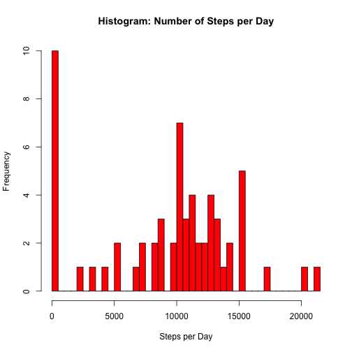
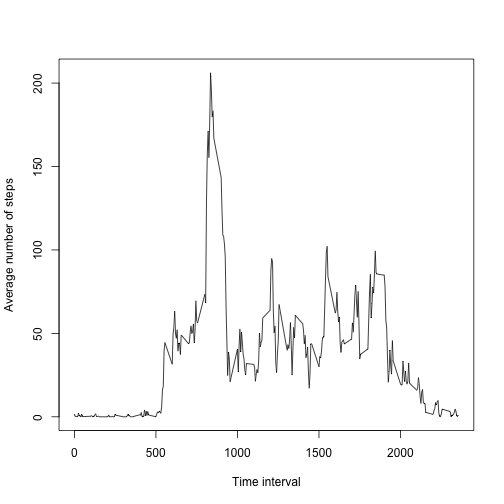
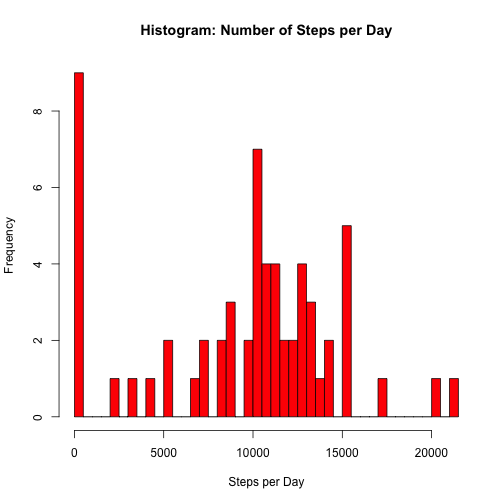
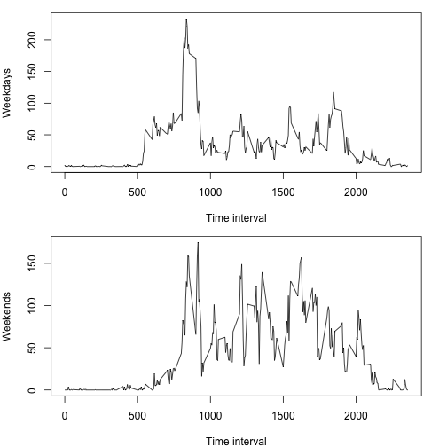
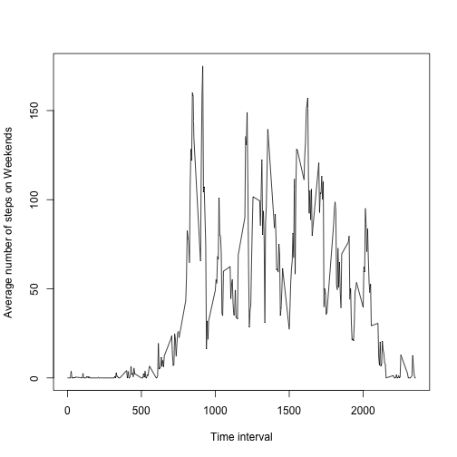

Reproducible Research: Peer Assessment 1
========================================
## Introduction
It is now possible to collect a large amount of data about personal
movement using activity monitoring devices such as a
[Fitbit](http://www.fitbit.com), [Nike
Fuelband](http://www.nike.com/us/en_us/c/nikeplus-fuelband), or
[Jawbone Up](https://jawbone.com/up). These type of devices are part of
the "quantified self" movement -- a group of enthusiasts who take
measurements about themselves regularly to improve their health, to
find patterns in their behavior, or because they are tech geeks. But
these data remain under-utilized both because the raw data are hard to
obtain and there is a lack of statistical methods and software for
processing and interpreting the data.

This analysis makes use of data from a personal activity monitoring
device. This device collects data at 5 minute intervals through out the
day. The data consists of two months of data from an anonymous
individual collected during the months of October and November, 2012
and include the number of steps taken in 5 minute intervals each day.

## Data
The data for this analysis can be downloaded from the course web
site:

* Dataset: [Activity monitoring data](https://d396qusza40orc.cloudfront.net/repdata%2Fdata%2Factivity.zip) [52K]

The variables included in this dataset are:

* **steps**: Number of steps taking in a 5-minute interval (missing values are coded as `NA`)
    
* **date**: The date on which the measurement was taken in YYYY-MM-DD format
    
* **interval**: Identifier for the 5-minute interval in which measurement was taken
    
The dataset is stored in a comma-separated-value (CSV) file and there are a total of 17,568 observations in this dataset.

## Task 1: Loading and preprocessing the data
### Requirement
Show any code that is needed to

1. Load the data (i.e. `read.csv()`)

2. Process/transform the data (if necessary) into a format suitable for your analysis

### Implementation
First let's unzip the file and then read it. The dates are reformated for later analysis.

```r
unzip(zipfile = "activity.zip")
activities <- read.csv("activity.csv")
activities$date <- as.Date(activities$date, format="%Y-%m-%d")
```

## Task 2: What is mean total number of steps taken per day?
### Requirement
For this part of the assignment, you can ignore the missing values in the dataset.

1. Calculate the total number of steps taken per day

2. If you do not understand the difference between a histogram and a barplot, research the difference between them. Make a histogram of the total number of steps taken each day

3. Calculate and report the mean and median of the total number of steps taken per day

### Implementation
First let's calculate the total number of steps per day.

```r
steps_per_day <- tapply(activities$steps, activities$date, sum, na.rm = TRUE)
```

A histogram of the total number of steps per day looks like the following:

```r
hist(steps_per_day, breaks = length(steps_per_day), main="Histogram: Number of Steps per Day", xlab="Steps per Day", ylab="Frequency", col="red")
```

 

The mean and median can be calculated like the following:

```r
mean(steps_per_day)
```

```
## [1] 9354.23
```

```r
median(steps_per_day)
```

```
## [1] 10395
```

## Task 3: What is the average daily activity pattern?
### Requirement
1. Make a time series plot (i.e. `type = "l"`) of the 5-minute interval (x-axis) and the average number of steps taken, averaged across all days (y-axis)

2. Which 5-minute interval, on average across all the days in the dataset, contains the maximum number of steps?

### Implementation
First let's create a time series plot. We need to aggregate and calculate the mean of the steps by time interval. Then we can draw the time series plot.


```r
agg <- aggregate(x = list(steps = activities$steps), by = list(interval = activities$interval), FUN = mean, na.rm = TRUE)
plot(agg$steps~agg$interval, type="l", xlab="Time interval", ylab="Average number of steps")
```

 

The interval with the maximum number of steps can be calculated easily from the aggregated data we used to draw the plot:


```r
agg[agg$steps == max(agg$steps), 1]
```

```
## [1] 835
```

## Task 4: Imputing missing values
### Requirements
Note that there are a number of days/intervals where there are missing values (coded as `NA`). The presence of missing days may introduce bias into some calculations or summaries of the data.

1. Calculate and report the total number of missing values in the dataset (i.e. the total number of rows with `NA`s)

2. Devise a strategy for filling in all of the missing values in the dataset. The strategy does not need to be sophisticated. For example, you could use the mean/median for that day, or the mean for that 5-minute interval, etc.

3. Create a new dataset that is equal to the original dataset but with the missing data filled in.

4. Make a histogram of the total number of steps taken each day and Calculate and report the mean and median total number of steps taken per day. Do these values differ from the estimates from the first part of the assignment? What is the impact of imputing missing data on the estimates of the total daily number of steps?

### Implementation
First we need to find out the number of rows that contain `NA`s.


```r
missing <- is.na(activities$steps)
length(missing[missing==TRUE])
```

```
## [1] 2304
```

We'll use the strategy to fill the mean steps of the particular interval, if we encounter `NA`s in the data set. We create a new dataset for this.

This can be achieved with the following code:

```r
imputed <- activities
for (i in 1:length(imputed$step)) {
  if (is.na(imputed$step[i])) {
    imputed$steps[i] <- agg$steps[i]
  }
}
```

First let's calculate the total number of steps per day again.

```r
steps_per_day <- tapply(imputed$steps, imputed$date, sum, na.rm = TRUE)
```

A histogram of the total number of steps per day looks like the following:

```r
hist(steps_per_day, breaks = length(steps_per_day), main="Histogram: Number of Steps per Day", xlab="Steps per Day", ylab="Frequency", col="red")
```

 

The mean and median can be calculated like the following:

```r
mean(steps_per_day)
```

```
## [1] 9530.724
```

```r
median(steps_per_day)
```

```
## [1] 10439
```

This shows that using mean values for `NA` raises mean and median a little bit, but doesn't change the analysis very much.

## Are there differences in activity patterns between weekdays and weekends?
Let's introduce new variables `weekday` and `weekend` to signal "weekend" or "weekday".


```r
imputed$day <- weekdays(imputed$date)
imputed$weekend <- imputed$day == "Saturday" | imputed$day == "Sunday"

weekend <- subset(imputed, weekend == TRUE)
weekday <- subset(imputed, weekend == FALSE)
```

Then plot weekday and weekend charts.

```r
# weekdays
averages <- aggregate(x = list(steps = weekday$steps), by = list(interval = weekday$interval), FUN = mean, na.rm = TRUE)
plot(averages$steps~averages$interval, type="l", xlab="Time interval", ylab="Average number of steps on Weekdays")
```

 

```r
# weekends
averages <- aggregate(x = list(steps = weekend$steps), by = list(interval = weekend$interval), FUN = mean, na.rm = TRUE)
plot(averages$steps~averages$interval, type="l", xlab="Time interval", ylab="Average number of steps on Weekends")
```

 

We can see that there is a peak on weekday around 8:30. Looks like people are on their way to work.
On weekends the average steps are more distributed over the day.
